# Mô tả bộ dữ liệu

## I. Cấu trúc bộ dữ liệu

### File 1: input.json

-   **Kiểu file**: JSON
-   **Mô tả file**: Lưu các dữ liệu về lệnh sản xuất, công đoạn sản xuất, nhân viên, máy móc
-   **Input gồm**:
    -   **productionOrders**: danh sách các lệnh sản xuất
        -   `id`: Mã lệnh sản xuất
        -   `name`: Tên lệnh sản xuất
        -   `quantity`: Số lượng cần đạt được
        -   `startDate`: Ngày bắt đầu dự kiến
        -   `endDate`: Ngày kết thúc dự kiến
    -   **operations**: danh sách công đoạn
        -   `id`: Mã công đoạn
        -   `productionOrderId`: Mã lệnh sản xuất
        -   `name`: Tên công đoạn
        -   `requiredMachineType`: Loại máy móc yêu cầu
        -   `requiredPosition`: Vị trí nhân viên yêu cầu
        -   `prevOperation`: Danh sách các công đoạn tiền nhiệm
        -   `kpis`: Danh sách các mục tiêu KPI đặt ra
            -   `id`: Mã KPI
            -   `name`: Tên KPI
            -   `weight`: Trọng số
            -   `value`: Giá trị ngưỡng đặt ra
            -   Hiện tại mỗi công đoạn đang xét có 2 loại KPI chính:
                -   KPI năng suất: số sản phẩm cần hoàn thành đúng hạn
                -   KPI chất lượng: số sản phẩm đạt chuẩn
    -   **assets**: danh sách các máy móc
        -   `id`: Mã máy móc
        -   `name`: Tên máy móc
        -   `machineType`: Loại máy móc
        -   `costPerHour`: Chi phí theo giờ
        -   `productivity`: Hệ số hiệu suất
    -   **workers**: danh sách nhân viên
        -   `id`: Mã nhân viên (ví dụ: W0001)
        -   `name`: Tên nhân viên
        -   `position`: Vị trí nhân viên
        -   `productivityKPI`: Năng suất làm việc trong 1 đơn vị thời gian (\_Lưu ý: 2 tiêu chí productivityKPI và qualityKPI được thiết lập ở đây để đơn giản khi chạy giải thuật, trên thực tế các giá trị này của nhân viên trong mỗi công đoạn là khác nhau)
        -   `qualityKPI`: Chất lượng làm việc
        -   `salaryPerHour`: Lương theo giờ

### File 2: monthly_schedule.json

-   **Kiểu file**: JSON
-   **Mô tả file**: Lưu lịch đục lỗ các ca làm việc của nhân viên (hiện tại: 0 là nhân viên không làm việc ca đó, 1 là nhân viên có thể làm việc ca đó)
-   **Input gồm**: danh lịch ca làm việc của nhân viên theo ngày
    -   `date`: Ngày
    -   `shift_count`: Số ca trong 1 ngày
    -   `work_duration_per_shift`: Thời gian làm việc mỗi ca tính theo giờ
    -   `schedule`: Danh sách các ca và trạng thái mỗi ca của nhân viên
        -   Mã nhân viên: Danh sách trạng thái mỗi

## II. Các tập dữ liệu thử nghiệm

1. Bộ dữ liệu 1

-   3 lệnh sản xuất, 21 công đoạn, 173 máy móc, 160 nhân viên

2. Bộ dữ liệu 2

-   4 lệnh sản xuất, 28 công đoạn, 190 máy móc, 160 nhân viên

3. Bộ dữ liệu 3

-   5 lệnh sản xuất, 35 công đoạn, 251 máy móc. 170 nhân viên

4. Bộ dữ liệu 4

-   6 lệnh sản xuất, 48 công đoạn, 303 máy móc, 170 nhân viên

5. Bộ dữ liệu 5

-   9 lệnh sản xuất, 63 công đoạn, 379 máy móc, 180 nhân viên

6. Bộ dữ liệu 6

-   18 lệnh sản xuất, 126 công đoạn, 379 máy móc, 180 nhân viên

## III. Kết quả chạy thử nghiệm

### Bộ 1

| Giải pháp | Số lệnh hoàn thành đúng hạn | Tổng số ca | Tổng chi phí |
| --------- | --------------------------- | ---------- | ------------ |
| 1         | 3                           | 7          | 114097.5     |
| 2         | 3                           | 8          | 112403.5     |
| 3         | 3                           | 8          | 111303.5     |
| 4         | 3                           | 8          | 112733.5     |
| 5         | 3                           | 7          | 109703.0     |
| 6         | 3                           | 8          | 110528.0     |
| 7         | 3                           | 8          | 108405.0     |
| 8         | 3                           | 7          | 116055.5     |
| 9         | 3                           | 7          | 112497.0     |
| 10        | 3                           | 8          | 111771.0     |
| 11        | 3                           | 7          | 111826.0     |
| 12        | 3                           | 8          | 110286.0     |
| 13        | 3                           | 8          | 110775.5     |
| 14        | 3                           | 8          | 111287.0     |
| 15        | 3                           | 8          | 111259.5     |
| 16        | 3                           | 8          | 111980.0     |
| 17        | 3                           | 8          | 110929.5     |
| 18        | 3                           | 7          | 112876.5     |
| 19        | 3                           | 8          | 112508.0     |
| 20        | 3                           | 7          | 113311.0     |
| 21        | 3                           | 8          | 110082.5     |
| 22        | 3                           | 8          | 109043.0     |
| 23        | 3                           | 7          | 116143.5     |
| 24        | 3                           | 8          | 111496.0     |
| 25        | 3                           | 8          | 109686.5     |
| 26        | 3                           | 7          | 112711.5     |
| 27        | 3                           | 7          | 111688.5     |
| 28        | 3                           | 7          | 111100.0     |
| 29        | 3                           | 7          | 112161.5     |
| 30        | 3                           | 8          | 110088.0     |

-   Lời giải tối ưu nhất: (3, 7, 109703.0)
-   Thời gian thực thi thuật toán: 11.77 giây

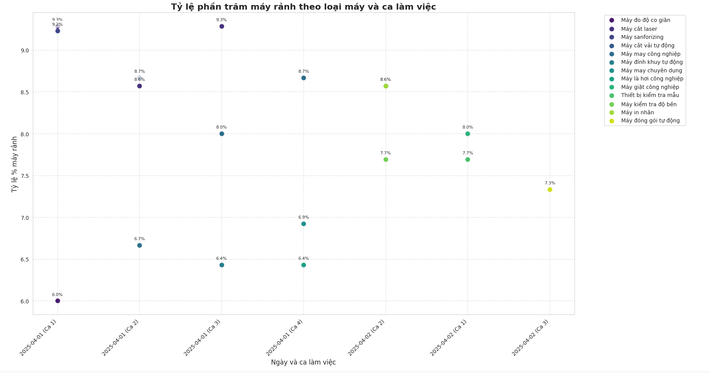

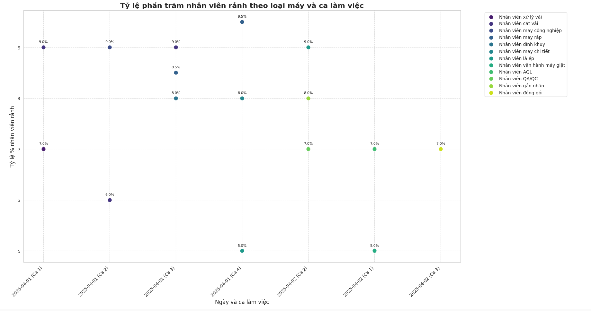

> **Nhận xét:** Nguyên nhân chính dẫn đến hiện tượng máy móc và nhân viên nhàn rỗi khi vẫn có công việc trong ca:
>
> -   Công đoạn đã phân bổ hết công việc
> -   Thiếu cân đối nguồn lực: có nhân viên nhưng không đủ máy móc để vận hành
> -   Thiếu cân đối nguồn lực: có máy móc nhưng không có nhân viên phù hợp để vận hành

### Bộ 2

| Giải pháp | Số lệnh hoàn thành đúng hạn | Tổng số ca | Tổng chi phí |
| --------- | --------------------------- | ---------- | ------------ |
| 1         | 4                           | 12         | 191812.5     |
| 2         | 4                           | 12         | 187324.5     |
| 3         | 4                           | 13         | 188303.5     |
| 4         | 4                           | 13         | 185482.0     |
| 5         | 4                           | 12         | 189057.0     |
| 6         | 4                           | 12         | 194133.5     |
| 7         | 4                           | 12         | 188006.5     |
| 8         | 4                           | 13         | 187913.0     |
| 9         | 4                           | 13         | 186109.0     |
| 10        | 4                           | 12         | 188738.0     |
| 11        | 4                           | 12         | 189684.0     |
| 12        | 4                           | 13         | 185493.0     |
| 13        | 4                           | 12         | 195090.5     |
| 14        | 4                           | 12         | 187907.5     |
| 15        | 4                           | 12         | 191988.5     |
| 16        | 4                           | 12         | 194216.0     |
| 17        | 4                           | 13         | 187885.5     |
| 18        | 4                           | 12         | 190701.5     |
| 19        | 4                           | 13         | 187594.0     |
| 20        | 4                           | 13         | 186934.0     |
| 21        | 4                           | 12         | 185372.0     |
| 22        | 4                           | 12         | 193407.5     |
| 23        | 4                           | 13         | 188457.5     |
| 24        | 4                           | 13         | 184338.0     |
| 25        | 4                           | 13         | 188001.0     |
| 26        | 4                           | 12         | 184167.5     |
| 27        | 4                           | 13         | 186340.0     |
| 28        | 4                           | 12         | 193182.0     |
| 29        | 4                           | 13         | 188897.5     |
| 30        | 4                           | 12         | 189150.5     |

-   Thời gian thực thi thuật toán: 20.89 giây
-   Lời giải tối ưu nhất: (4, 12, 184167.5)

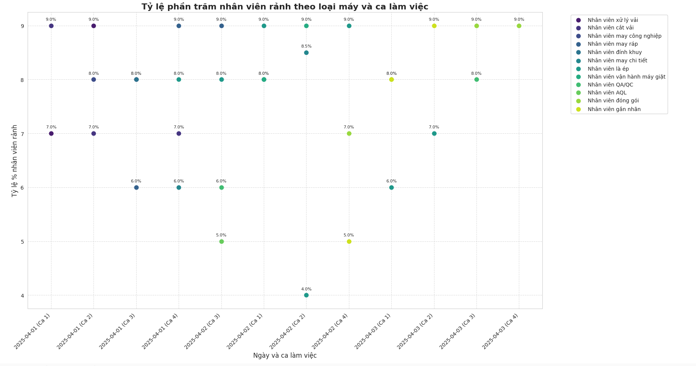

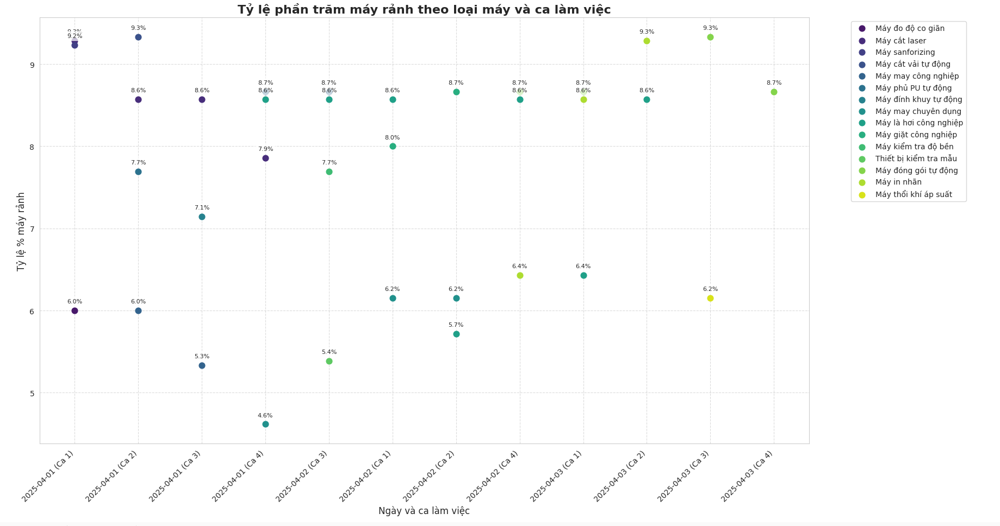

### Bộ 3:

| Giải pháp | Số lệnh hoàn thành đúng hạn | Tổng số ca | Tổng chi phí |
| --------- | --------------------------- | ---------- | ------------ |
| 1         | 5                           | 12         | 274351.0     |
| 2         | 5                           | 13         | 276771.0     |
| 3         | 5                           | 13         | 275280.5     |
| 4         | 5                           | 12         | 275572.0     |
| 5         | 5                           | 13         | 290213.0     |
| 6         | 5                           | 12         | 267630.0     |
| 7         | 5                           | 12         | 282161.0     |
| 8         | 5                           | 13         | 278261.5     |
| 9         | 5                           | 13         | 271793.5     |
| 10        | 5                           | 13         | 287391.5     |
| 11        | 5                           | 13         | 279757.5     |
| 12        | 5                           | 13         | 283893.5     |
| 13        | 5                           | 12         | 278993.0     |
| 14        | 5                           | 13         | 285367.5     |
| 15        | 5                           | 13         | 285092.5     |
| 16        | 5                           | 13         | 279812.5     |
| 17        | 5                           | 13         | 288260.5     |
| 18        | 5                           | 13         | 274906.5     |
| 19        | 5                           | 13         | 282623.0     |
| 20        | 5                           | 13         | 284471.0     |
| 21        | 5                           | 13         | 282276.5     |
| 22        | 5                           | 12         | 273740.5     |
| 23        | 5                           | 12         | 276573.0     |
| 24        | 5                           | 14         | 273861.5     |
| 25        | 5                           | 12         | 281512.0     |
| 26        | 5                           | 13         | 277150.5     |
| 27        | 5                           | 13         | 273498.5     |
| 28        | 5                           | 12         | 280324.0     |
| 29        | 5                           | 14         | 270286.5     |
| 30        | 5                           | 12         | 280494.5     |

-   Thời gian thực thi thuật toán: 26.90 giây
-   Lời giải tối ưu nhất: (5, 12, 267630.0)

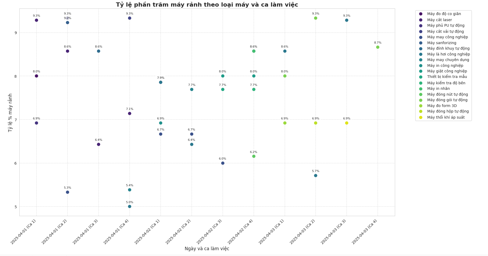

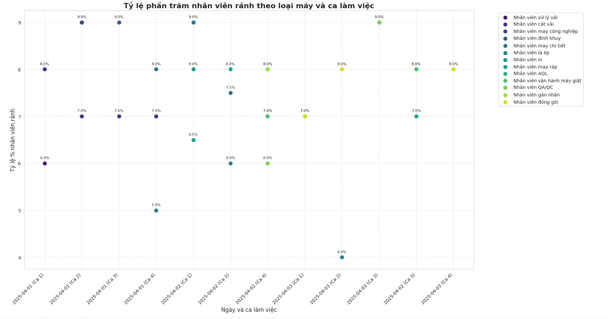

### Bộ 4:

| Giải pháp | Số lệnh hoàn thành đúng hạn | Tổng số ca | Tổng chi phí |
| --------- | --------------------------- | ---------- | ------------ |
| 1         | 6                           | 29         | 386199.0     |
| 2         | 6                           | 31         | 403128.0     |
| 3         | 6                           | 31         | 393173.0     |
| 4         | 6                           | 32         | 384290.5     |
| 5         | 6                           | 31         | 380792.5     |
| 6         | 6                           | 31         | 398013.0     |
| 7         | 6                           | 26         | 398860.0     |
| 8         | 6                           | 28         | 395070.5     |
| 9         | 6                           | 30         | 401082.0     |
| 10        | 6                           | 30         | 389477.0     |
| 11        | 6                           | 28         | 381584.5     |
| 12        | 6                           | 30         | 395373.0     |
| 13        | 6                           | 29         | 394696.5     |
| 14        | 6                           | 29         | 397749.0     |
| 15        | 6                           | 27         | 404899.0     |
| 16        | 6                           | 32         | 385302.5     |
| 17        | 6                           | 29         | 407577.5     |
| 18        | 6                           | 30         | 403705.5     |
| 19        | 6                           | 30         | 398469.5     |
| 20        | 6                           | 31         | 390175.5     |
| 21        | 6                           | 32         | 394168.5     |
| 22        | 6                           | 30         | 387277.0     |
| 23        | 6                           | 27         | 397969.0     |
| 24        | 6                           | 30         | 401252.5     |
| 25        | 6                           | 29         | 390010.5     |
| 26        | 6                           | 27         | 383504.0     |
| 27        | 6                           | 31         | 394080.5     |
| 28        | 6                           | 31         | 397237.5     |
| 29        | 6                           | 32         | 389339.5     |
| 30        | 6                           | 26         | 396242.0     |

-   Thời gian thực thi thuật toán: 31.11 giây
-   Lời giải tối ưu nhất: (6, 26, 396242.0)

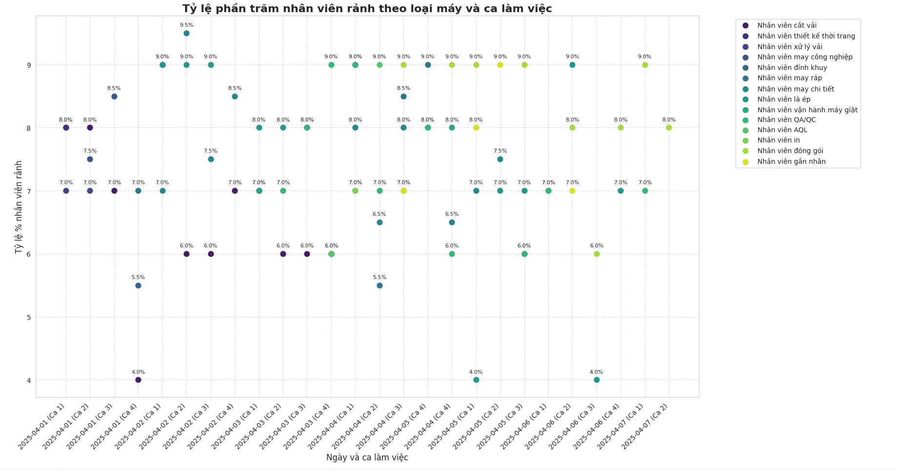

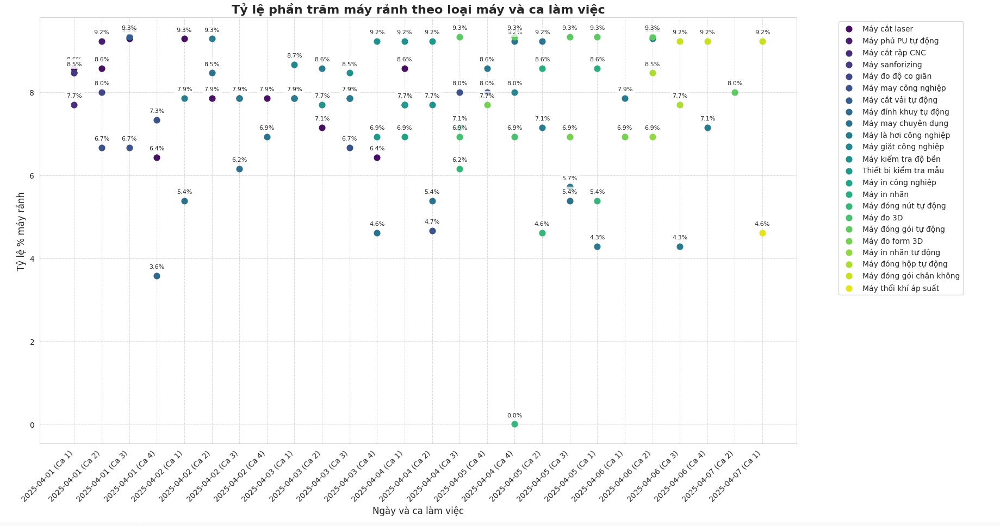

### Bộ 5:

| Giải pháp | Số lệnh hoàn thành đúng hạn | Tổng số ca | Tổng chi phí |
| --------- | --------------------------- | ---------- | ------------ |
| 1         | 9                           | 48         | 611165.5     |
| 2         | 9                           | 49         | 600083.0     |
| 3         | 9                           | 46         | 598235.0     |
| 4         | 9                           | 47         | 598130.5     |
| 5         | 9                           | 51         | 598009.5     |
| 6         | 9                           | 48         | 605154.0     |
| 7         | 9                           | 46         | 603993.5     |
| 8         | 9                           | 53         | 606672.0     |
| 9         | 9                           | 45         | 587449.5     |
| 10        | 9                           | 54         | 593989.0     |
| 11        | 9                           | 43         | 593928.5     |
| 12        | 9                           | 46         | 589149.0     |
| 13        | 9                           | 54         | 589726.5     |
| 14        | 9                           | 48         | 601441.5     |
| 15        | 9                           | 43         | 591783.5     |
| 16        | 9                           | 52         | 583995.5     |
| 17        | 9                           | 43         | 594704.0     |
| 18        | 9                           | 48         | 619751.0     |
| 19        | 9                           | 50         | 598620.0     |
| 20        | 9                           | 49         | 596035.0     |
| 21        | 9                           | 48         | 610786.0     |
| 22        | 9                           | 51         | 601568.0     |
| 23        | 9                           | 52         | 615862.5     |
| 24        | 9                           | 44         | 596623.5     |
| 25        | 9                           | 46         | 608806.0     |
| 26        | 9                           | 49         | 594302.5     |
| 27        | 9                           | 44         | 587031.5     |
| 28        | 9                           | 45         | 587114.0     |
| 29        | 9                           | 42         | 600066.5     |
| 30        | 9                           | 48         | 596563.0     |

-   Thời gian thực thi thuật toán: 36.02 giây
-   Lời giải tối ưu nhất: (9, 42, 600066.5)

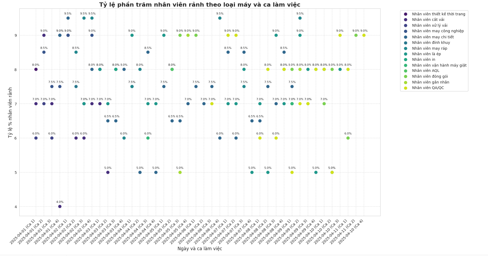

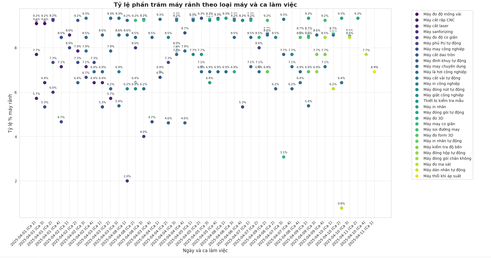

### Bộ 6

| Giải pháp | Số lệnh hoàn thành đúng hạn | Tổng số ca | Tổng chi phí |
| --------- | --------------------------- | ---------- | ------------ |
| 1         | 15                          | 85         | 1183633.0    |
| 2         | 17                          | 84         | 1214609.0    |
| 3         | 15                          | 89         | 1193247.0    |
| 4         | 15                          | 94         | 1213685.0    |
| 5         | 15                          | 82         | 1202102.0    |
| 6         | 15                          | 83         | 1204175.5    |
| 7         | 15                          | 87         | 1191140.5    |
| 8         | 15                          | 95         | 1207151.0    |
| 9         | 15                          | 89         | 1188583.0    |
| 10        | 15                          | 82         | 1191360.5    |
| 11        | 15                          | 85         | 1197251.0    |
| 12        | 15                          | 84         | 1212893.0    |
| 13        | 17                          | 80         | 1216825.5    |
| 14        | 15                          | 83         | 1210940.5    |
| 15        | 17                          | 83         | 1182654.0    |
| 16        | 15                          | 87         | 1178353.0    |
| 17        | 15                          | 86         | 1209686.5    |
| 18        | 16                          | 81         | 1184606.5    |
| 19        | 15                          | 83         | 1216165.5    |
| 20        | 15                          | 84         | 1236026.0    |
| 21        | 15                          | 85         | 1199313.5    |
| 22        | 17                          | 80         | 1233930.5    |
| 23        | 15                          | 90         | 1193379.0    |
| 24        | 17                          | 83         | 1216858.5    |
| 25        | 16                          | 81         | 1186795.5    |
| 26        | 16                          | 84         | 1190871.0    |
| 27        | 15                          | 93         | 1186938.5    |
| 28        | 15                          | 89         | 1231004.5    |
| 29        | 15                          | 93         | 1187774.5    |
| 30        | 18                          | 77         | 1217392.0    |

-   Thời gian thực thi thuật toán: 41.63 giây
-   Lời giải tối ưu nhất:(18, 77, 1217392.0)

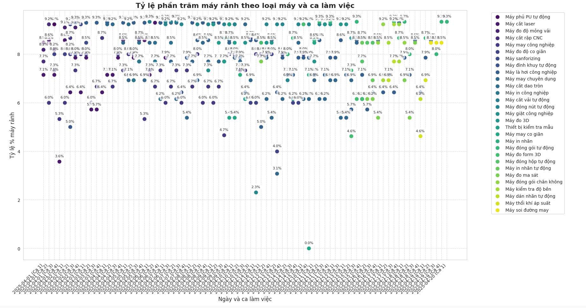

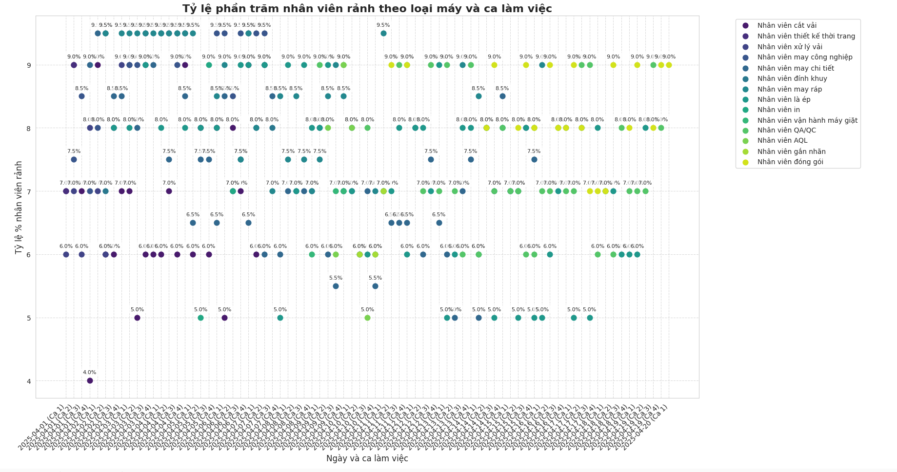

## IV. Đánh giá kết quả

### Hiệu suất giải thuật

| Bộ dữ liệu | Số lệnh SX | Số công đoạn | Số máy móc | Số nhân viên | Số lệnh hoàn thành | Tối ưu ca | Tổng chi phí | Thời gian chạy (s) |
| ---------- | ---------- | ------------ | ---------- | ------------ | ------------------ | --------- | ------------ | ------------------ |
| Bộ 1       | 3          | 21           | 173        | 160          | 3                  | 7         | 109,703.0    | 11.77              |
| Bộ 2       | 4          | 28           | 190        | 160          | 4                  | 12        | 184,167.5    | 20.89              |
| Bộ 3       | 5          | 35           | 251        | 170          | 5                  | 12        | 267,630.0    | 26.90              |
| Bộ 4       | 6          | 48           | 303        | 180          | 6                  | 26        | 396,242.0    | 31.11              |
| Bộ 5       | 9          | 63           | 379        | 180          | 9                  | 42        | 600,066.5    | 36.02              |
| Bộ 6       | 18         | 126          | 379        | 180          | 18                 | 77        | 1217392.0    | 41.63              |

### Nhận xét

-   Qua các bộ dữ liệu ta có thể thấy, tùy vào mỗi lần chạy cho ra kết quả fitness khác nhau
-   Thời gian thực hiện qua các bộ dữ liệu có số lượng công đoạn lớn có cùng tập nhân viên, máy móc với bộ dữ liệu có số lượng công đoạn vừa là không đáng kể
-   Kết quả thử nghiệm cho thấy mỗi lần chạy giải thuật đều tạo ra các giải pháp tối ưu khác nhau, điều này thể hiện tính chất ngẫu nhiên và đa dạng trong không gian tìm kiếm của giải thuật di truyền.
-   Đáng chú ý là thời gian thực thi giữa các bộ dữ liệu không tăng đáng kể, ngay cả khi số lượng công đoạn tăng lên gấp đôi. Điều này chứng tỏ giải thuật có khả năng mở rộng tốt và vẫn duy trì hiệu suất ổn định khi quy mô bài toán tăng lên vì độ phức tạp về thời gian chủ yếu phụ thuộc vào số lượng nguồn lực (nhân viên, máy móc)
